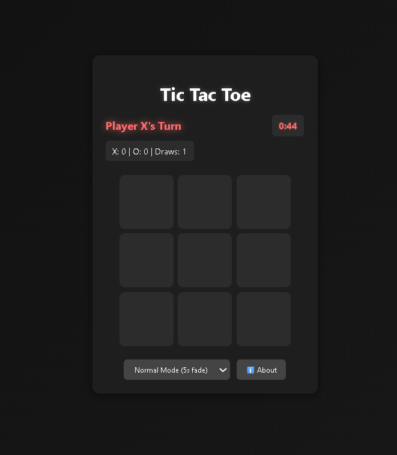

# 🎯 Disappearing Tic Tac Toe

A modern twist on the classic Tic Tac Toe game with disappearing moves and timed rounds. Built with pure HTML, CSS, and JavaScript.



## 🚀 Features

- **Disappearing Moves**: Marks fade away after a few seconds, making strategy dynamic
- **1-Minute Rounds**: Each round has a 60-second timer with auto-restart
- **Multiple Game Modes**: 
  - Normal Mode (5s fade)
  - Rapid Mode (3s fade) 
  - Blitz Mode (2s fade)
- **Visual Timer Bars**: Each move shows a countdown timer
- **Smooth Animations**: Modern CSS animations and transitions
- **Responsive Design**: Works perfectly on desktop and mobile
- **Score Tracking**: Persistent scoring across multiple rounds
- **Keyboard Shortcuts**: Quick controls for better UX

## 🎮 How to Play

1. **Take turns** placing X and O on the 3x3 grid
2. **Watch the timer** - your marks will start fading after a few seconds
3. **Get 3 in a row** before your marks completely disappear
4. **Beat the clock** - each round lasts exactly 1 minute
5. **Auto-restart** - game continues automatically to the next round

## 🎯 Game Rules

- Each round lasts 1 minute maximum
- Marks disappear after a few seconds (varies by mode)
- Cells become available again after marks disappear
- Win by getting 3 in a row before your marks fade
- Game auto-restarts if time runs out
- Scores are tracked across all rounds

## ⌨️ Keyboard Shortcuts

- **M** - Toggle between game modes
- **H** - Show/hide rules and about information
- **Esc** - Close any open modal

## 🛠️ Technical Details

### Built With
- **HTML5** - Semantic structure
- **CSS3** - Modern styling with Grid, Flexbox, and animations
- **Vanilla JavaScript** - Game logic and interactivity
- **Remix Icons** - Beautiful icon set

### File Structure
```
project/
│
├── index.html          # Main HTML file (combined version)
├── index-separated.html # HTML with external CSS/JS
├── styles.css          # All CSS styles
├── script.js           # Game logic and functionality
├── screenshot.png      # Game preview image
└── README.md          # This file
```

### Key Features Implemented
- **State Management**: Separate game state from visual display
- **Timer System**: Multiple timer management for marks and rounds
- **Responsive Layout**: CSS Grid and Flexbox for all screen sizes
- **Modal System**: Clean popup interfaces for game info
- **Animation System**: Smooth transitions and effects

## 🌟 Game Modes

| Mode | Fade Time | Total Time | Max Moves |
|------|-----------|------------|-----------|
| Normal | 5 seconds | 7 seconds | 20 moves |
| Rapid | 3 seconds | 4.5 seconds | 15 moves |
| Blitz | 2 seconds | 3 seconds | 12 moves |

## 📱 Browser Compatibility

- ✅ Chrome (latest)
- ✅ Firefox (latest)
- ✅ Safari (latest)
- ✅ Edge (latest)
- ✅ Mobile browsers

## 🚀 Getting Started

1. **Clone the repository**
   ```bash
   git clone https://github.com/Rahul-Meena01/New-Tic-Tac-Toe.git
   ```

2. **Open in browser**
   - Open `index.html` for the combined version
   - Or open `index-separated.html` for the modular version

3. **Start playing!**
   - No installation or setup required
   - Works offline once loaded

## 🎨 Design Highlights

- **Dark Theme**: Modern dark UI with cyan accents
- **Gradient Backgrounds**: Smooth color transitions
- **Glow Effects**: Text shadows and box shadows for depth
- **Smooth Animations**: CSS transitions for all interactions
- **Mobile-First**: Responsive design that scales beautifully

## 👨‍💻 Developer

**Rahul Meena**
- GitHub: [@Rahul-Meena01](https://github.com/Rahul-Meena01)
- Instagram: [@why______dude](https://instagram.com/why______dude)
- LinkedIn: [rahul-meena-m3401](https://linkedin.com/in/rahul-meena-m3401)

## 📄 License

This project is open source and available under the [MIT License](LICENSE).

## 🤝 Contributing

Contributions, issues, and feature requests are welcome! Feel free to check the [issues page](https://github.com/Rahul-Meena01/New-Tic-Tac-Toe/issues).

## ⭐ Show Your Support

Give a ⭐️ if you like this project!

---

**Built with ❤️ by Rahul Meena** | **Version 2.0.0**